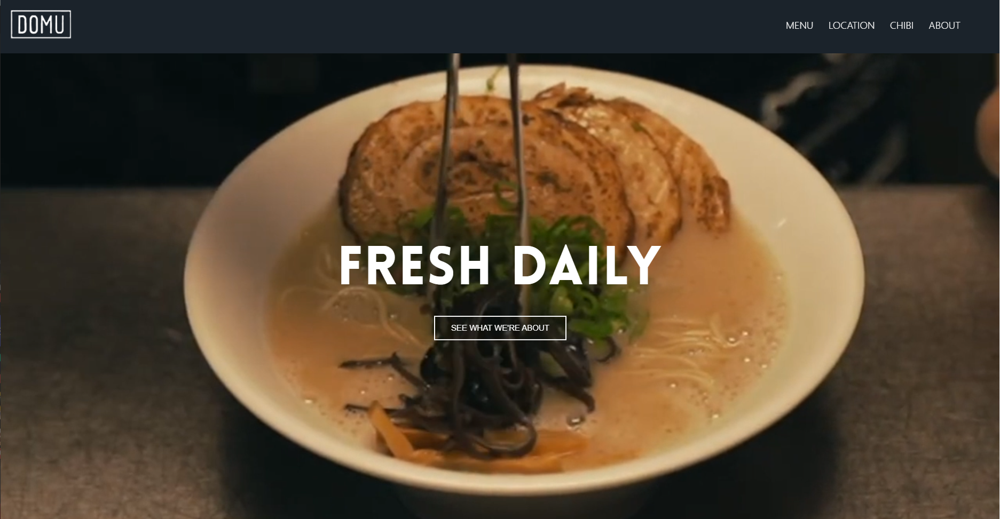
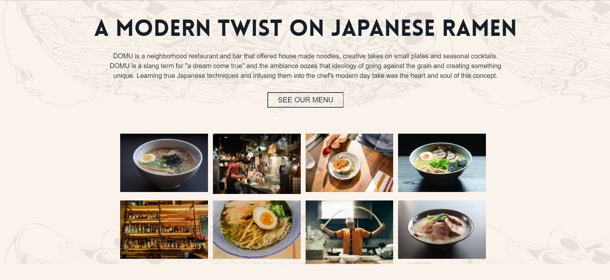
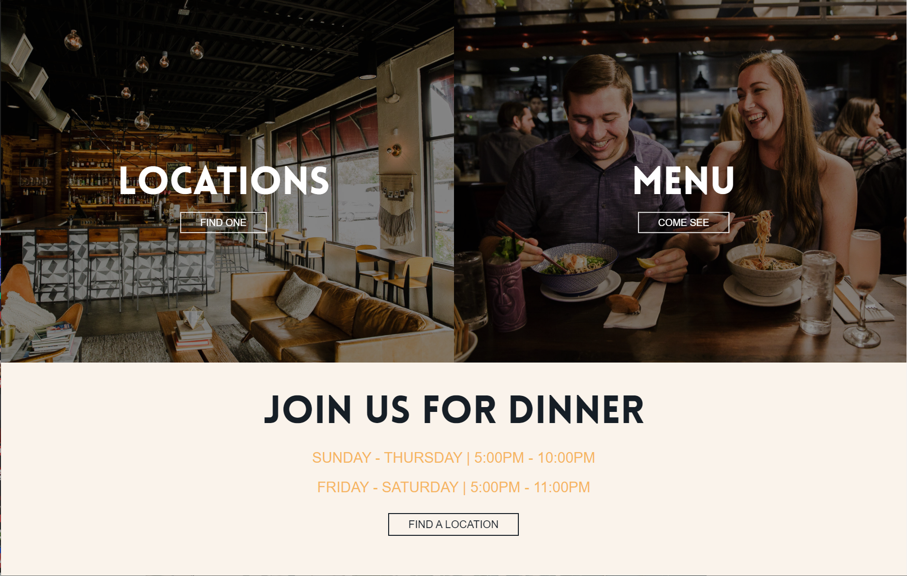
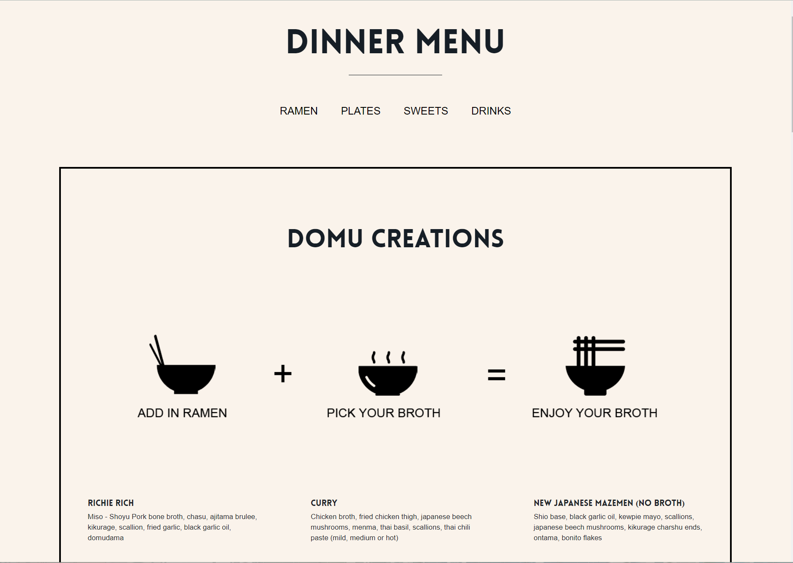

# Domu 
 

 
 ## Description 
 Domu is a neighborhood restaurant and bar that offers house made noodles creative takes on small plates and seasonal cocktails. I decided to take on this personal project and redesign their current site. I felt that I could give a different design spin on it improve the user experience and a more user-friendly design. Tools used are JavaScript(ES6) CSS3 HTML5 Bootstrap5 and GSAP.
 [link to deployed application](https://itiskchengs.github.io/Domu_Project/)

 
 
 
 

 ## Table of Contents 

 * [Installation](#installation) 

 * [Usage](#usage) 

 * [License](#license) 

 * [Contributing](#contributing) 

 * [Tests](#Tests) 

 * [Questions](#questions)

 
 ## Installation 
None

 
 ## Usage 
 Follow deployed [link](https://itiskchengs.github.io/Domu_Project/)

 
 ## License 
 This application uses a license from MIT 
  
 * Link: https://opensource.org/licenses/MIT

 
 ## Contributing 
 None

 
 ## Tests 
 None

 
 ## Questions 
 Contact us on GitHub or email us with further questions:

  * GitHub: [itiskchengs](https://github.com/itiskchengs)

 * Email: itskcheng@gmail.com